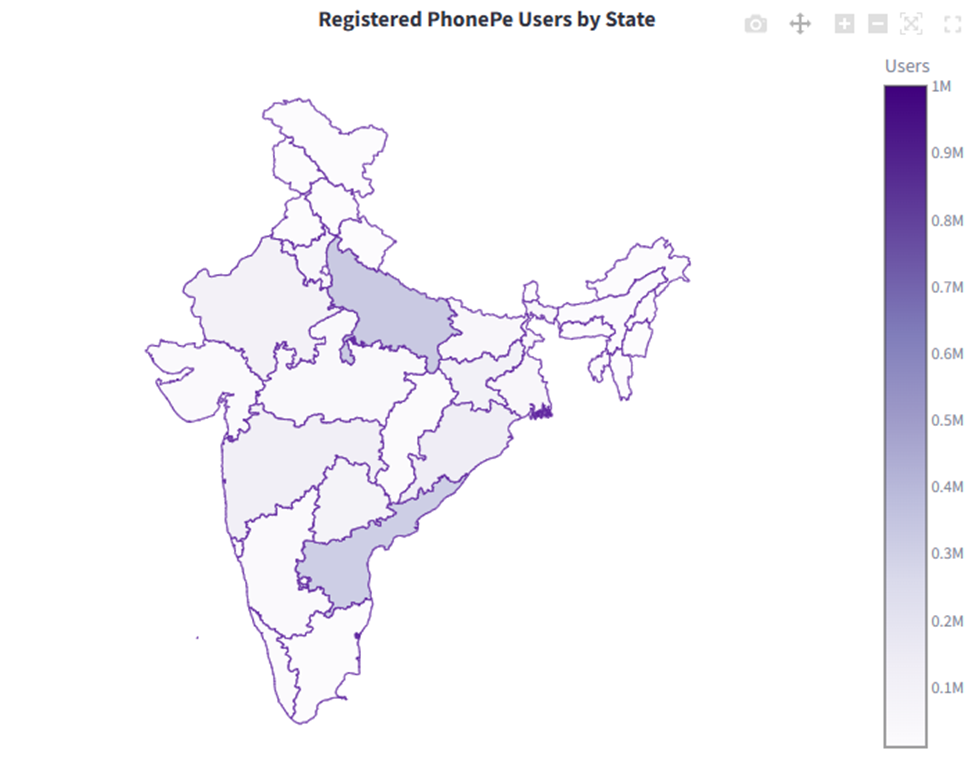
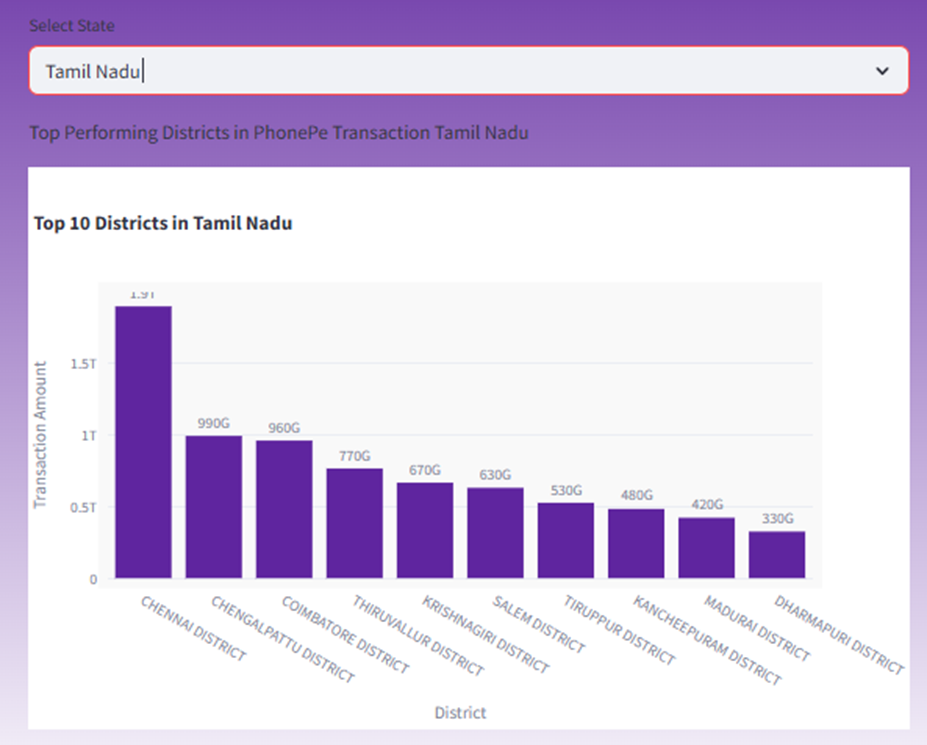
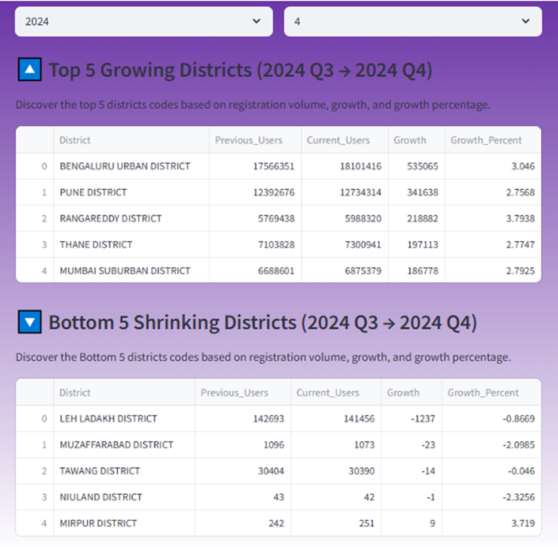

# 1. Project title
PhonePe Transaction Insights Dashboard

An interactive dashboard and analytical study of digital payment trends across India, powered by PhonePe Pulse data.

# 2. Project Overview

This project analyzes PhonePe’s publicly available data to uncover insights into digital payment trends, user behavior, and geographic variations across India. Built using Python, SQL, and Streamlit, it transforms complex datasets into actionable business intelligence through interactive visualizations.

# 3. Domain

Finance / Digital Payments

# 4. Key Technologies & Skills
Programming: Python

Database: PostgreSQL, SQLAlchemy

Visualization: Plotly, Seaborn, Matplotlib

Web App: Streamlit

Data Handling: Pandas, JSON, CSV

# 4. Objectives
Transform and analyze PhonePe data to extract key insights.

Visualize trends across states, districts, and quarters.

Build an interactive dashboard for dynamic user exploration.

Provide strategic recommendations based on analysis.

# 5. Dataset Overview
Source: PhonePe Pulse GitHub Repository

Data Categories:

Aggregated Data: User metrics, transactions, insurance

Map Data: Geospatial metrics by state/district

Top Data: Rankings of top-performing regions

Transformation: Raw JSON ➝ Cleaned CSV using custom Python scripts.

# 6. Project Structure

PHONEPE_PLUSE_ANALYZER/
├── data/
│   └── Data_Extract/                  # CSV files derived from raw JSON
├── image/
│   ├── Image.jpg
│   └── PhonePe_Logo.png
├── db_load.py                         # Loads data to PostgreSQL
├── main.ipynb                         # Main analysis & EDA
├── phonepe.py                         # Streamlit app
├── Phonepe_Docs.docx                  # Detailed project documentation
├── README.md                          # This file
├── .gitignore
├── LICENSE

# 7.  Setup Instructions
### 7.1. Clone the Repository

git clone https://github.com/JeevaVedha/Phonepe_Pluse_Analyzer.git

cd Phonepe_Pluse_Analyzer

### 7.2. Install Required Packages

pip install -r requirements.txt

### 7.3. Load Data into PostgreSQL

Update your DB credentials in db_load.py and run:

python db_load.py

### 7.4. Launch Streamlit Dashboard

streamlit run phonepe.py

# 8. Key Features
    User Registration Analysis: Map-based user registration over time.

    Transaction Trends: Top-performing states/districts by transaction value and count.

    Device Analysis: Dominant device brands and their growth metrics.

    Insurance Insights: Regional breakdown of insurance transactions.

    Quarterly & Yearly Filters: Drill down by time periods for detailed insights.

# 9. Sample Visualizations
## 9.1. Choropleth Maps
        

## 9.2.Bar & Line Charts
        

        

## 9.3.Tables
        

## 9.4.Interactive Drop-down and Slider Filters
        
        

# 10. Analysis Insights
Top & Bottom Performing Regions

Growth Trends by Quarter

User Adoption Rates

Category-Wise Transaction Distribution

Device-Based Usage Trends

# 11. Future Improvements
Integrate live API to auto-refresh data.

Add advanced filters and forecasting models.

Enable user-based role authentication for dashboard access.

# 12.References
PhonePe Pulse

Plotly Docs

Streamlit Docs

Pandas Docs

SQLAlchemy Docs